# Slide deck for the advisor pitch

~16 slides, ~25 minutes. The goal is **a scoping decision** on the thesis-phase plan, not a
defence rehearsal and not a demo walkthrough.

> **Revised 2026-09-10 (v2).** Rebuilt for on-screen density: diagram or table first, text kept to
> a few short bullets — prose lives in `script.md`, not here. Structure and content still follow
> `Recommended_system.md` (the proposed system) and the frozen `experiment-protocol.md` /
> `data-card.md` (evaluation) — nothing below is invented for the slide.

## Table of contents

**Part 1 — Problem statement and motivation**
1. [Title](#slide-1)
2. [The cost of serving locally](#slide-2)
2b. [The idea — load conversion](#slide-2b)
3. [Why a simple cache isn't enough](#slide-3)

**Part 2 — Proposed system architecture**
4. [System overview](#slide-4)
5. [How a question flows through the system](#slide-5)
5b. [Framework, tools, and technologies](#slide-5b)

**Part 3 — Admission control**
6. [The mechanism](#slide-6)
7. [Why this is an independent contribution](#slide-7)

**Part 4 — Two-tier cache**
8. [The workflow](#slide-8)
8b. [Three outcomes, in detail](#slide-8b)
9. [Why similarity alone is unsafe](#slide-9)
9b. [How the evidence check actually decides](#slide-9b)
10. [Two fixes, and what's still open](#slide-10)
11. [Invalidation](#slide-11)

**Part 5 — Evaluation method**
12. [Dataset and workload](#slide-12)
13. [Configurations compared](#slide-13)
14. [Metrics — two headlines](#slide-14)
15. [Statistical rigor](#slide-15)
16. [Developed so far, and limitations](#slide-16)

---

**1 · Title**
Scalable RAG QA for e-commerce specs and policies. Name, supervisor, date.

**2 · The cost of serving locally**

> **~1 question every 5 seconds**, measured — this machine's local-model serving cost.

| Constraint | Consequence |
| :--- | :--- |
| Redundant traffic (E-commerce Q&A repeats heavily) | Most cost, today, is repeats paying full price |
| Fixed memory budget | Overload doesn't just slow down — it can swap and degrade *everything* |

**The idea:** convert redundant compute-bound work into memory-bound cache lookups. Whether
that's *safe* is the rest of this talk.

**2b · The idea — load conversion**

$$\lambda_{max} = \min\left(\frac{\mu_{gen}}{1-h},\ \frac{\mu_{hit}}{h}\right)$$

| Term | Meaning |
| :--- | :--- |
| `λ_max` | Max sustainable request rate |
| `μ_gen` | Generation throughput (the expensive path) |
| `μ_hit` | Cache-hit throughput — **Tier-2 ≈ 61 rps** (pays an embedding round-trip); Tier-1 ≈ 8000 rps |
| `h` | Hit rate — reuse actually **accepted**; whatever the safety gate refuses counts as a miss |

Raising `h` moves the system off the `μ_gen` term and onto the much larger `μ_hit` term — that's
the entire mechanical argument for why caching raises the ceiling.

**Honest finding, pre-registered before measuring:** on this machine's envelope, the crossover
point `h*` (where the two terms trade off) sits **above 0.99** — higher than any realistic
workload reaches. So the system is **generation-bound throughout its operating range** — a
reportable result, not a failed measurement, and stated as an expected outcome *before* the data
existed.

**3 · Why a simple cache isn't enough**

| Approach | Problem |
| :--- | :--- |
| Exact-text cache | Only catches byte-identical repeats |
| Similarity-only cache (standard approach) | Catches paraphrases, but similarity is *wording*, not *correctness* — can serve a confidently wrong answer |

**The problem this thesis solves:** reuse based on evidence, not wording — plus a separate
mechanism that keeps the machine from falling over under load.

---

**4 · System overview**

```mermaid
%%{init: {"flowchart": {"curve": "linear", "nodeSpacing": 50, "rankSpacing": 95}}}%%
flowchart LR
    Client["Concurrent clients<br/>product and policy questions"]
    Editor["Catalogue / policy editor<br/>source document edited"]

    subgraph GW["Gateway — the contribution"]
        direction TB
        T1["Tier 1 — exact cache<br/>normalized-hash + product_id"]
        T2["Tier 2 — semantic cache<br/>partition + similarity search<br/>(product / policy / both)"]
        G4["Lexical-support gate<br/>answer-vs-evidence check"]
        SF["Request coalescing<br/>one generation per distinct query"]
        Permit["Admission control<br/>bounded queue, then permit pool"]
        Inval["Invalidator<br/>dependency-purge on source edit"]
        T1 -->|"on miss"| T2
        T2 -->|"no safe match"| SF
        T2 -->|"candidate"| G4
        G4 -->|"evidence too thin → refuse"| SF
        SF -->|"one permit per distinct query"| Permit
    end

    Shed(["503 Service Unavailable<br/>Retry-After, pool saturated"])
    CacheDB[("Cache store<br/>answer entries + dependency index")]

    subgraph INFRA["Answer engine — used as-is, not modified"]
        direction TB
        RAG["Retrieval + answer service<br/>finds material; calls the model on a miss"]
        LLM["Language model<br/>generates the answer"]
        RAG -->|"generation path only"| LLM
    end

    CorpusDB[("Retrieval index<br/>source content + search vectors")]

    Client -->|"question"| T1
    Editor -->|"edit event"| Inval
    Permit -->|"queue also full"| Shed
    T2 -->|"retrieve — every Tier-1 miss, no permit needed"| RAG
    Permit -->|"generate — permit held"| RAG
    GW -.->|"lookup · write-back · purge"| CacheDB
    RAG -.->|"search"| CorpusDB

    classDef contrib fill:#2E75B6,stroke:#1F3A5F,color:#fff;
    classDef infra fill:#EEF3F8,stroke:#9DB8D2,color:#1F3A5F;
    classDef store fill:#FFF4E0,stroke:#E0A030,color:#5A4012;
    classDef busy fill:#FBEAEA,stroke:#B04A4A,color:#5A1A1A;
    class T1,T2,G4,SF,Permit,Inval contrib;
    class Client,Editor,RAG,LLM infra;
    class CacheDB,CorpusDB store;
    class Shed busy;
```

- Retrieval + language model = black box, used as-is.
- **Retrieval never needs a permit — only generation does**, which is why Tier-2 candidates can
  always be checked before anything touches the memory budget.
- Two stores: the cache (answers + dependency index) and the retrieval index (source content) are
  kept separate.
- Everything inside the gateway box = built and measured by this thesis.

**5 · How a question flows through the system**

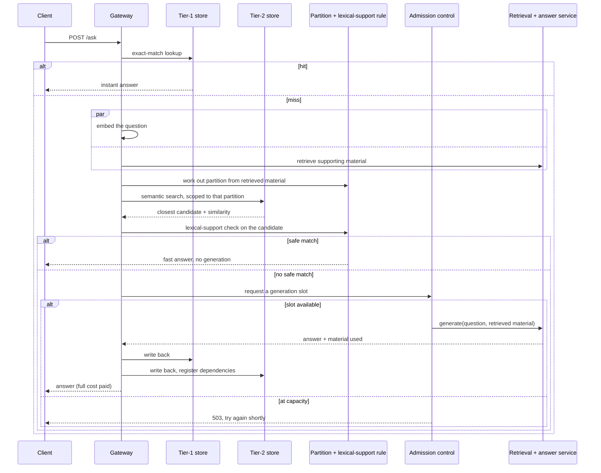

Only the bottom branch touches the model. Everything above it is the load-conversion gain.

**5b · Framework, tools, and technologies**

| Layer | Technology | Why |
| :--- | :--- | :--- |
| Gateway | **Go**, stdlib `net/http` | Native concurrency primitives (`RWMutex`, `atomic.Pointer`, channels, `singleflight`) — ~20MB idle vs. ~2GB for a Python+ML-runtime equivalent |
| Cache + vector search | **Redis Stack / RedisVL** | Native vector index, **FLAT (exact)** — frozen, deterministic, no ANN noise on the reuse-safety signal |
| RAG orchestrator | **Python 3.11+ / LlamaIndex** | Mature ingestion, chunking, vector-store abstractions |
| LLM runtime | **Ollama**, native on host (not Docker) | macOS containers have no Metal GPU passthrough |
| Generation model | **Qwen 3.5 2B**, `q4_K_M` | Chosen by measurement, not reputation — smallest footprint of 5 candidates screened on this machine's real envelope |
| Embedding model | **nomic-embed-text**, 768-dim | Ollama-servable, 274MB — frozen once chosen |
| Service comms | **gRPC** (gateway↔RAG), REST/JSON (client↔gateway) | Typed contract + HTTP/2 reuse on the internal edge; REST kept where interoperability matters |
| Reuse decision | Pure Go, set intersection | No ML runtime anywhere on the cache hit path |
| UI | React + Vite, static bundle served by the gateway | No separate Node process competing for the memory envelope |
| Load testing | k6 / Locust | Traffic generated **off-box**, never co-hosted with the system under test |

Every box above the model/retrieval line is a deliberate, budget-driven pick — not a default. Two
rules keep it that way: the **LLM and embedding model are frozen once chosen** (a mid-study swap
invalidates every comparison), and everything here is an **architectural** choice, not a research
one — swap Go for another language and the reuse-safety experiment tests identically.

---

**6 · The mechanism**

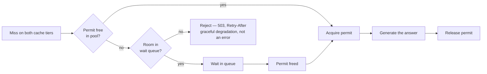

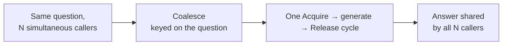

| Mechanism | Purpose |
| :--- | :--- |
| Bounded concurrency | Never run more generations than memory allows |
| Bounded queue → reject | Fail fast and clean, not slow and silent |
| Coalescing | N identical in-flight questions cost one generation |

**7 · Why this is an independent contribution**

| | |
| :--- | :--- |
| Depends on the caching result? | **No** — stands alone |
| Is this pattern novel? | No — recognized, active practice in current LLM-serving systems |
| Do the caching papers this thesis is positioned against do this? | **No** — none bound concurrency or shed under memory pressure |
| Weight in this thesis | **60%** of the engineering contribution (cache: 15%, integration: 25%) |

---

**8 · The workflow**

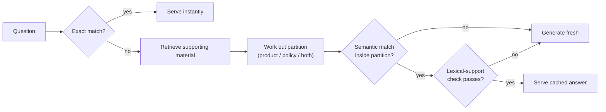

| Stage | What it checks |
| :--- | :--- |
| Tier 1 | Byte-identical question → hash lookup |
| Tier 2 | Meaning-similar question → similarity score |
| Partition | Same product/policy? Derived from evidence, not guessed |
| Lexical-support check | Does the cached answer's wording still match the fresh evidence? |

**8b · Three outcomes, in detail**

*Tier-1 hit — no search, no model:*
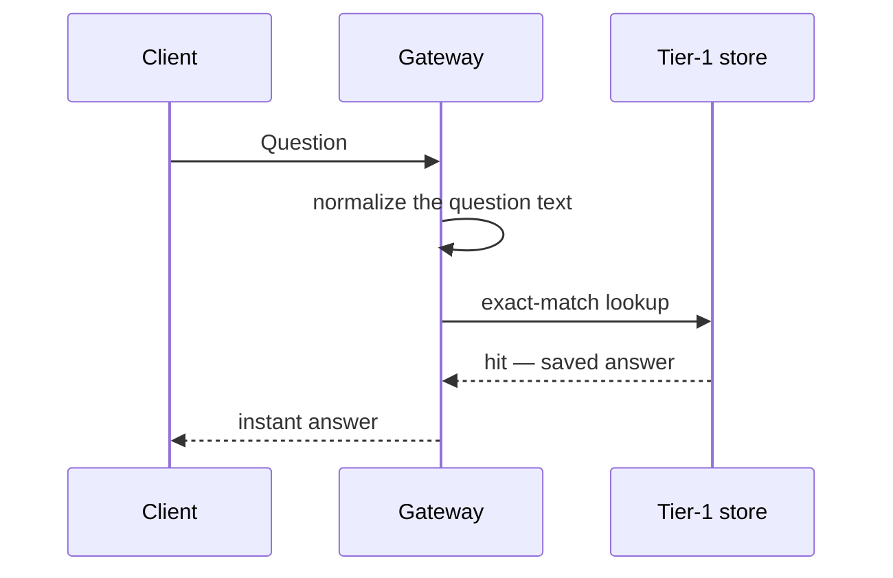

*Tier-2 hit — partitioned search + evidence check, no generation:*
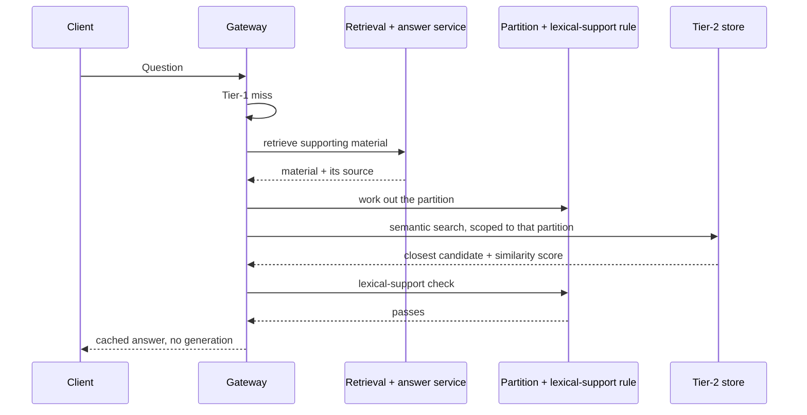

*Miss — the only path that touches the memory budget:*
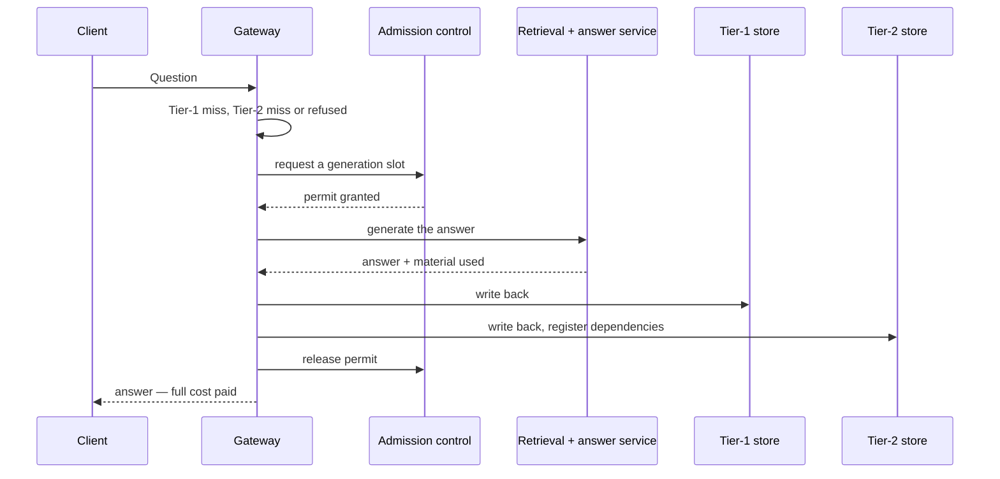

**9 · Why similarity alone is unsafe**

| | |
| :--- | :--- |
| Two questions | Worded almost identically |
| Differ by | Which product / which condition |
| Similarity score | High |
| Correct answers | **Different** |

A similarity-only cache cannot tell these apart — it serves the wrong answer with no visible sign
of error.

**9b · How the evidence check actually decides**

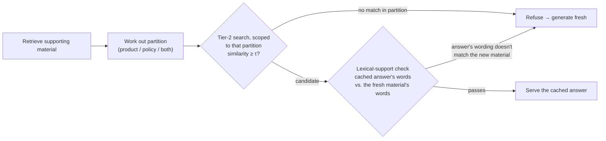

| Stage | Reads | Decides |
| :--- | :--- | :--- |
| Partition + similarity | Which product/policy the question is grounded in, plus how close the wording is | Is there even an eligible candidate to check? |
| Lexical support | The cached answer's own words vs. the words in the freshly-retrieved material | Does that answer still hold up against **today's** evidence? |

`S(answer, evidence) = |words(answer) ∩ words(evidence)| / |words(answer)|` — a real case from
this project's own corpus: a cached electronics-return answer and a warranty question land in
similarly-scored candidates by similarity alone — the words settle it. *"return, refund, window,
day"* barely appears in the warranty material's *"warranty, defect, coverage"* — refused.

**Not the chunk-ID containment score in the current report.** That earlier rule
(`overlap = |retrieved ∩ entry_sources| / |entry_sources|`) is this thesis's original, frozen C1
claim — but on this project's own corpus it scored two opposite-correct-answer cases
**identically** (0.80 vs. 0.80, no threshold separates them), and partition-matching alone already
beat it on every measured disagreement. It stays in the evaluation only as a **reported baseline**
(Part 5's five-configuration comparison) — not as part of what this design actually serves.

**The gap even this can't see:** if the *same* piece of content states two opposite conditions
together (e.g. "opened" and "unopened" terms in one paragraph), the words match either way — the
check above can't tell the readings apart. That's closed **before any of this runs**, when the
corpus is written: **condition-tagging** keeps opposing conditions in separate chunks, so partition
+ lexical support have something to actually tell apart.

**10 · Two fixes, and what's still open**

| Failure mode | Caught by |
| :--- | :--- |
| Different product/policy, similar wording | ✅ Partitioning |
| Same partition, wrong specific answer | ✅ Lexical-support check (previous slide) |
| Same evidence fetched, question flips one word | ❌ **Neither** — closed by condition-tagging at content-authoring time (previous slide), not a runtime check |

Stated up front, not left for a question to find: row 3 is the central open risk in this design.

**11 · Invalidation**

*The purge, end to end — a single writer, so concurrent edits never race each other:*
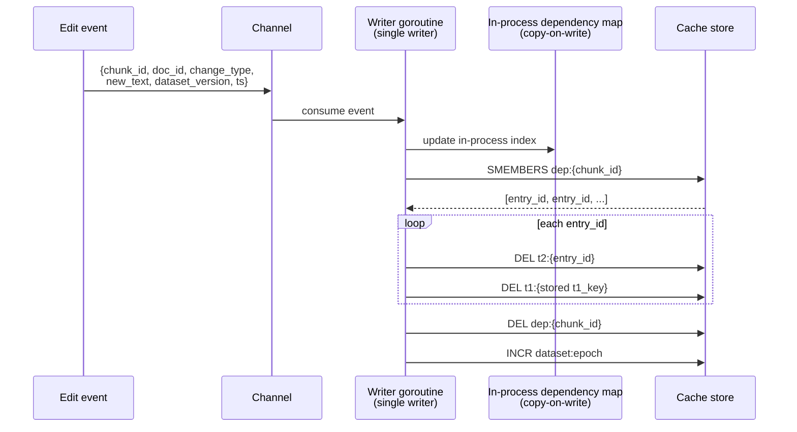

*The race the version guard exists to close:*
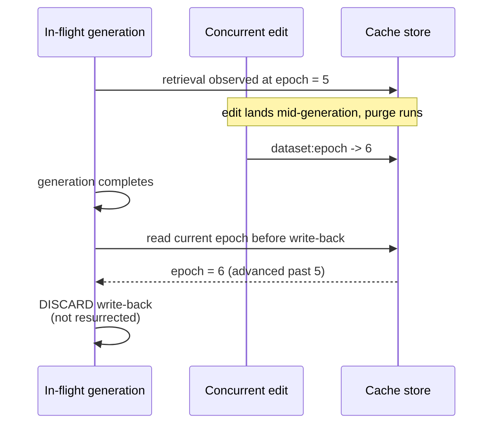

| | |
| :--- | :--- |
| Reads | Lock-free — in-process copy-on-write map, no mutex on the hit path |
| Writes | Single writer goroutine, fed by a channel — no concurrent-write races by construction |
| Purge | Complete, not best-effort — every dependent entry, both tiers, every time |
| Race guard | A generation started before an edit must not overwrite the purge — `dataset:epoch` decides |
| Pattern | Same as CDN tag-based cache invalidation (Akamai/Fastly-style surrogate keys) — well-understood, applied here |
     
---

**12 · Dataset and workload**

| Source | Content | Why |
| :--- | :--- | :--- |
| **Amazon product data** (McAuley-lab, UCSD) | Product catalog + specs | Public, real product data |
| **AmazonQA** (McAuley-lab, UCSD) | Product questions | Real shopper questions — genuine paraphrase structure, not invented |
| Authored in-house | Policy questions | No public dataset contains store-policy Q&A; edits need author control |
| Constructed on purpose | Hard cases — similar wording, different answer | Exercises the safety mechanism, not just the average case |

Workload must pass quality gates before use (enough hard cases, no exact-match collisions) — a
corpus that fails is fixed, not worked around.

⚠️ Amazon/AmazonQA redistribution terms are unresolved (no license stated) — if not permitted, ship
a download+build script and hash manifest instead of the raw data.

**13 · Configurations compared**

| # | Configuration | Represents |
| :---: | :--- | :--- |
| 1 | No cache | Uncached baseline |
| 2 | Exact-match only | Tier 1 alone |
| 3 | Similarity-only | Standard off-the-shelf semantic cache |
| 4 | Source-overlap rule | Containment alone — this thesis's original frozen rule, now a reported baseline (slide 9b) |
| 5 | Full system | Everything together — partitioning, the lexical-support gate, admission control, invalidation |

Each run twice — content static, and content edited mid-run — to test invalidation under real
change.

**14 · Metrics — two headlines**

| Headline A — systems | Headline B — research |
| :--- | :--- |
| Throughput as load increases, cache on/off | Reuse rate vs. wrong-answer rate |
| Reject rate under overload (clean, not silent) | Source-overlap rule vs. naive baseline, at a fixed acceptable error rate |
| Stays in a safe memory zone (unsafe run → discarded) | Graded by an independent AI referee, never the answer's own generator |

Supporting: latency broken into stages; latency compared **at matched reuse rate**, so "reuses
more" can't hide "also slower."

**15 · Statistical rigor**

- Thresholds tuned on one data split, reported on a separate held-out split
- Results split: cross-product traps (easy) vs. same-product traps (hard) — reported separately
- A no-benefit outcome is pre-registered, with diagnostics, before the data exists
- Every rate reported with a confidence interval, from repeated runs

**16 · Developed so far, and limitations**

| Built | Status |
| :--- | :--- |
| Retrieval pipeline | ✅ Working end to end |
| Gateway — admission control + both cache tiers | ✅ Implemented, functionally tested on a trial corpus |
| Web interface for manual testing | ✅ Built |

| Not yet built | Status |
| :--- | :--- |
| Lexical-support check (G4) | Designed, not implemented |
| Invalidation | Designed, not implemented — next build item |
| Retrieval page-context awareness | Known gap — evaluation design already accounts for it |
| Admission-control numbers | Small functional trials only, not yet final |

None of tonight's pre-thesis numbers are citable — they confirm the mechanisms run, not the
evaluation itself.

---

## Questions to rehearse

| They ask | You answer |
| :--- | :--- |
| "Why not just buy more RAM / use a cloud API?" | The fixed local envelope **is** the research setting. Bigger hardware moves the ceiling, doesn't remove the need to govern it. |
| "This is just caching." | 15% of the weighting. 60% is admission control (Part 3); the rest is integration. |
| "Why not key purely by product ID?" | Partitioning uses evidence, not pre-retrieval metadata — a question can span more than one partition; the evaluation measures how much benefit a simpler key would already capture. |
| "What if the source-overlap rule shows no benefit?" | Pre-registered as a reportable outcome (slide 15), with diagnostics. |
| "Does the reuse rule ever get it wrong?" | Yes — slide 10, row 3, stated up front. Two fixes narrow it; neither alone closes it. |
| "How much of this is actually built vs. planned?" | Slide 16 — the honest split. |
| "Why is the corpus small?" | Deliberately small but gated — must pass checks before anything is measured on it. |
| "What about Redis at real scale — won't it run out of RAM?" | Real limit, not dodged: the vector index is FLAT, fully in-memory, no disk-backed option. Out of scope by design (single-node envelope, ADR-009) — HNSW is the noted scaling path, not enabled here because approximate search would inject noise into the exact signal C1 measures. |
