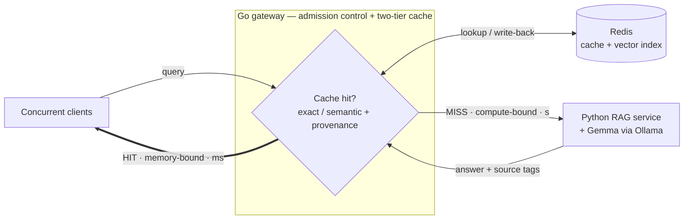

# Scalable QA Platform for E-Commerce

A high-concurrency **Go gateway** that lets a single 16 GB MacBook M1 serve a Retrieval-Augmented
Generation assistant for e-commerce product specifications and store policies — under concurrent load,
without swapping, and without serving wrong or stale answers.

Bachelor's thesis project. Systems engineering with one focused research claim.

---

## The problem

A RAG assistant answers questions like *"can I return this laptop after 30 days?"* by retrieving the
relevant policy text and asking an LLM to answer from it. That works fine for one user and falls apart
for many, for two reasons that compound:

- **Generation is the bottleneck.** Autoregressive decoding is compute-bound, and a naive pipeline
  re-runs it for questions it has already answered in slightly different words.
- **Concurrency is an availability risk, not just a latency one.** Model weights and every in-flight
  request's KV cache draw from the *same* fixed unified-memory pool. Admitting more work than the
  envelope holds does not slow the machine down gracefully — it pushes the OS into swap, then OOM.

So the obvious fix for load — run more requests in parallel — is precisely the action that destabilizes
the machine.

## The approach

**Load conversion.** Turn compute-bound, non-deterministic LLM generation into lightweight,
deterministic, memory-bound cache lookups, and govern what little generation remains.

The gateway is an **admission controller and resource governor**, not a proxy. It bounds in-flight
generation to what unified memory can actually hold, sheds excess load explicitly rather than collapsing,
and serves the redundant majority of traffic from a two-tier cache that never touches the LLM.

Sustainable load is then:

> **λ_max = min( μ_gen / (1 − h) , μ_hit / h )**  where *h* is the cache hit share

At *h* = 0 capacity is μ_gen — a handful of requests per second. As *h* rises, the binding constraint
moves off the LLM and onto the lookup path. Finding that crossover on fixed hardware is the systems
result.

## The research claim

Semantic caches decide *"can I reuse this cached answer?"* from **embedding similarity between question
texts**. That signal cannot separate a genuinely equivalent question from one that merely looks alike:
*"what is the return window?"* asked about two product categories with different policies embeds almost
identically — and reusing the answer serves a confidently wrong one.

A RAG system knows something a prompt-level cache does not: **where the cached answer came from.** Before
reusing, the gateway retrieves for the incoming query and compares the chunks returned against the
cached entry's recorded provenance:

```
reuse  iff  overlap( retrieve(q), sources(e) ) ≥ θ   and   sim(q, e) ≥ τ
```

The rule is deterministic and inspectable — the decision is two chunk-ID lists side by side, which a
reader can verify. The claim under test is narrow and falsifiable: *at a stated false-hit budget, adding
the provenance test sustains a higher hit rate than the best fixed similarity threshold.* If it does not,
that null result is pre-registered and reportable.

## Architecture



Three paths: a **Tier-1 hit** (hash lookup, no embedding), a **Tier-2 hit** (embed → vector search →
provenance check), and a **miss**, which must first acquire a generation permit before reaching the LLM.
Without a permit inside budget, the gateway returns `503 busy, retry` rather than admitting work the
memory envelope cannot hold.

Cached answers are tagged with the source chunks that produced them, so when a policy document is edited
the dependent entries are purged exactly — no waiting for a TTL, and no stale answers surviving because
a generation was in flight during the edit.

## Stack

| Layer | Choice | Why |
| :--- | :--- | :--- |
| Gateway | **Go** | Goroutines, `atomic.Pointer` copy-on-write, `singleflight`, `x/sync/semaphore`; ~20 MB idle in a 16 GB budget where a Python equivalent with an ML runtime would cost ~2 GB — roughly one concurrent generation slot |
| Cache + vector search | **Redis** (RedisVL) | Sub-ms lookups, exact FLAT vector index, LRU and TTL in one store |
| RAG service | **Python** (LlamaIndex) | Ingestion, chunking, retrieval — invoked only on a miss |
| LLM | **Gemma 4 E4B** via Ollama, 4-bit | Edge-sized; runs natively (Docker on macOS has no Metal passthrough) |
| Seam | **gRPC** | Pooled HTTP/2 channel; a retrieval-only RPC lets the provenance check run without paying for generation |
| Load testing | **k6**, off-box | A co-hosted generator would steal CPU in exactly the high-load region being measured |

## Repository layout

```
gateway/       Go gateway — the contribution
  cmd/           wiring only
  internal/      httpapi · cache · reuse · deps · admission · ragclient · embed · telemetry
rag/           Python RAG service (LlamaIndex + gRPC)
contracts/     .proto — the single definition of the Go↔Python seam
experiments/   workload generator, replay harness, load scenarios, results
Makefile       the command surface — run `make help`
```

## Status

Build phase begins **W5 (Aug 10, 2026)**. Pre-thesis submission **Aug 31**; thesis complete **Dec 13**.

| Weeks | Lands |
| :--- | :--- |
| W5 | Memory-envelope spike, corpus ingestion, retrieval with stable chunk IDs |
| W6–W7 | RAG service over gRPC, gateway with Tier-1 and Tier-2 caches |
| W9–W11 | Source-aware invalidation with a concurrency-safe dependency map |
| W12–W15 | The provenance rule, judged correctness evaluation |
| W16–W19 | Admission control, then the load and redundancy sweeps |

## Running it

Not yet runnable end-to-end — that lands in W6–W7. Once it does:

```bash
make setup     # report missing tooling
make ingest    # build the index
make dev       # redis + rag service + gateway
make ask Q="can I return this laptop after 30 days?"
```

## License

Not yet chosen. Some corpus data may not be redistributable, so the license and the data-release policy
have to be decided together.
