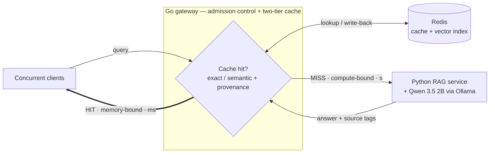

# Scalable QA Platform for E-Commerce

A high-concurrency **Go gateway** that lets a single 16 GB MacBook M1 serve a Retrieval-Augmented
Generation assistant for e-commerce product specifications and store policies — under concurrent
load, without swapping, and without serving wrong or stale answers.

Bachelor's thesis project. Systems engineering with one focused research claim.

---

## The problem

A RAG assistant answers questions like *"can I return this laptop after 30 days?"* by retrieving the
relevant policy text and asking an LLM to answer from it. That works for one user and falls apart
for many, for two reasons that compound:

- **Generation is the bottleneck.** Autoregressive decoding is compute-bound, and a naive pipeline
  re-runs it for questions it has already answered in slightly different words.
- **Concurrency is an availability risk, not just a latency one.** Model weights and every in-flight
  request's KV cache draw from the *same* fixed unified-memory pool. Admitting more work than the
  envelope holds does not degrade gracefully — it pushes the OS into swap, then OOM.

So the obvious fix for load — run more requests in parallel — is precisely the action that
destabilises the machine.

## The approach

**Load conversion.** Turn compute-bound, non-deterministic LLM generation into lightweight,
deterministic, memory-bound cache lookups, and govern what little generation remains.

The gateway is an **admission controller and resource governor**, not a proxy. It bounds in-flight
generation to the slots the model server actually serves (one — ADR-003, in `docs/decisions.md`),
sheds excess load explicitly rather than letting it queue invisibly, and serves the redundant
majority of traffic from a two-tier cache that never touches the LLM.

Sustainable load is then:

> **λ_max = min( μ_gen / (1 − h) , μ_hit / h )**  where *h* is the cache hit share

μ_gen is fixed by the hardware envelope. Ollama serves the frozen model at **one generation slot**
(ADR-003), and the feasibility spike's **≈ 28.2 tokens/sec** at `num_ctx = 8192`, holding macOS green
pressure at 1.7 GB resident, is a planning figure until it is re-measured under sustained load. That leaves **h as the only free variable that raises capacity** — and `h ≤ ρ`, the true
redundancy of the workload, for any cache that serves no false hit, because exceeding it is only
achievable by being wrong.

**Which makes minimising false hits and serving more requests the same problem, not two.** It is
the spine of the whole plan.

## The research claim

Semantic caches decide *"can I reuse this cached answer?"* from **embedding similarity between
question texts**. That signal cannot separate a genuinely equivalent question from one that merely
looks alike: *"what is the return window?"* asked about two product categories with different
policies embeds almost identically — and reusing the answer serves a confidently wrong one.

A RAG system knows something a prompt-level cache does not: **where the cached answer came from.**
Before reusing, the gateway retrieves for the incoming query and tests four conjuncts:

```
reuse  iff  sim(q, e) ≥ τ
       and  namespace(q) = namespace(e)
       and  overlap( retrieve(q), sources(e) ) ≥ θ
       and  support( answer(e), text(retrieve(q)) )
```

> **What runs today is a subset of this rule** — see [Status](#status). The gateway serves
> `sim ≥ τ ∧ namespace`; the containment test is computed and logged but gates nothing, and the
> support gate is not built.

Every term is deterministic and inspectable — chunk-ID set intersection and token overlap, no model
on the hit path. The claim under test is narrow and falsifiable: *at a stated false-hit budget, the
provenance and support tests sustain a higher hit rate than the best fixed similarity threshold.* If
they do not, that null result is pre-registered and reportable.

Neither half is claimed as novel — provenance-gated reuse is concurrent work, and the support gate
is adopted from prior work. What is claimed is the **characterisation on a fixed envelope**, and
the residual the rule does **not** close is carried inside the claim rather than deferred to a
limitations section: two questions about **opposing conditions** — *opened* against *unopened* —
retrieve the same evidence and defeat all four conjuncts at once. The corpus answers it structurally
by never putting opposing conditions in the same document; the surviving rate is reported beside the
headline.

## Architecture



Three paths: a **Tier-1 hit** (hash lookup, no embedding), a **Tier-2 hit** (embed and retrieve in
parallel → one namespace-scoped vector search → the reuse rule), and a **miss**, which must first
acquire a generation permit before reaching the LLM. Without a permit inside budget the gateway
returns `503 busy, retry` rather than letting the work queue invisibly inside the model server,
which serves one generation slot (ADR-003).

Cached answers are tagged with the source chunks that produced them. **The design:** when a policy
document is edited, the dependent entries are purged exactly — no waiting for a TTL, and no stale
answers surviving because a generation was in flight during the edit. **Not built yet** (Phase 4):
the dependency map that does the purging, `gateway/internal/deps/`, is a stub.

## Stack

| Layer | Choice | Why |
| :--- | :--- | :--- |
| Gateway | **Go** | Goroutines, a channel-based counting semaphore with a bounded wait queue (`admission`), a hand-rolled `singleflight`-style coalescer (`coalesce`) — no `x/sync` dependency; the `atomic.Pointer` copy-on-write dependency map is the Phase 4 design, not yet code; ~20 MB idle in a 16 GB budget where a Python equivalent with an ML runtime would cost ~2 GB — roughly one concurrent generation slot |
| Cache + vector search | **Redis** (RedisVL) | Sub-ms lookups, exact FLAT vector index, one store for both tiers |
| RAG service | **Python** (LlamaIndex) | Ingestion, chunking, retrieval — invoked only on a miss |
| LLM | **Qwen 3.5 2B** via Ollama, `q4_K_M`, `think: false` | **Chosen by measurement, not reputation** — 1.7 GB resident, the smallest of five candidates that passed the RAG-QA screen; runs natively, since Docker on macOS has no Metal passthrough |
| Seam | **gRPC** | Pooled HTTP/2 channel; a retrieval-only RPC lets the provenance check run without paying for generation |
| Load testing | **k6**, co-hosted | No second machine exists (ADR-001). k6's own cost at the sweep's rates is measured — 1.0 → 4.8 % of one core, 21–28 MB, indicative — but that is not an interference measurement, so a co-hosted figure is reported as a bound, an indicative reading or nothing, never as a ceiling |

## Repository layout

```
gateway/       Go gateway — the contribution
  cmd/           wiring only
  internal/      httpapi · cache · reuse · admission · coalesce · telemetry · ragclient · embed · catalog
                 deps — a stub: source-aware invalidation (C2) is not built
rag/           Python RAG service (LlamaIndex + gRPC)
contracts/     .proto — the single definition of the Go↔Python seam
experiments/   k6 load scenarios, corpus and envelope scripts, results
ui/            debug UI (built with `make ui`; the gateway serves it)
data/          dev-v0 (development corpus, not citable) · v1 (experimental corpus, not yet built)
docs/          the plan, the decision log, the contracts, the corpus card, task trails
Makefile       the command surface — run `make help`
```

## Documents

| Document | What it is |
| :--- | :--- |
| `docs/super-plan.md` | The phase plan, in force. Each phase ends on a binary exit criterion |
| `docs/decisions.md` | The decision log. An `ADR-NNN` anywhere in this repository means an entry here |
| `docs/architecture.md` | Folder structure and module boundaries |
| `docs/contracts/interfaces.md` | The wire contracts: HTTP, gRPC, chunk IDs, Redis schemas, the evaluation log |
| `docs/contracts/requirements.md` | FR / NFR / RR — a skeleton, unfilled |
| `docs/data-card.md` | Corpus provenance, licensing, the G1–G5 gate |
| `docs/work/` | One trail per task, named `<date>-<slug>` |

## Status

Build began **W5 (Aug 10, 2026)**. Pre-thesis submitted **Aug 31**; thesis complete **Dec 13**.

The RAG service and the gateway both run end-to-end today: two-tier cache, the reuse rule with its
three lanes, admission control and request coalescing are built and tested, and `httpapi` is tested
on every exit path of `Ask`. Three things are **not** true yet, and the claim above should be read
with them:

- **The served Tier-2 rule is `similarity ∧ namespace`.** θ is computed and logged as a
  counterfactual but gates nothing (open finding F-K in `docs/super-plan.md`), and the support gate
  is Phase 2.
- **Source-aware invalidation (C2) is not built.** `gateway/internal/deps/` is a stub (Phase 4).
- **No citable result exists.** The `v1` corpus, workload generator, judge and figure pipeline are
  Phases 3–5, and `dev-v0` is a development corpus.

The schedule is **eight phases with binary exit criteria** rather than weeks — see
`docs/super-plan.md`.

| Phase | | |
| :--- | :--- | :--- |
| 1 | Instrument integrity — nothing measured before this is evidence | ✅ exit criterion met 2026-10-07 |
| 2 | The answer–evidence support gate | **current** |
| 3 | Corpus and workload (longest lead) | |
| 4 | Source-aware invalidation | |
| 5 | Judging, the false-hit budget, the figure pipeline | |
| 6 | The reuse frontier on held-out test | |
| 7 | Capacity under concurrent load | |
| 8 | Write-up and defence | |

## Running it

```bash
make setup                                          # report missing tooling
cd rag && pip3 install -e '.[dev]'                  # install the RAG service
make ingest                                         # chunk + embed the corpus into Redis
make dev                                            # redis + rag service + gateway (functional, not citable)
make ask Q="can I return this laptop after 30 days?"
make verify                                         # lint + build + test
make env-check                                      # frozen Ollama envelope vs the live runner (loads both models)
make seam-check                                     # texts reach Go aligned with chunk_ids; verify never runs it
```

Two environment constraints that are not optional: Redis must be **`redis-stack-server`** (the plain
formula ships a config referencing search modules it does not bundle), and **Ollama runs natively on
the host, never in Docker** — macOS containers have no Metal passthrough, and a CPU-bound LLM
invalidates every latency measurement.

Before any run that loads the model, check memory pressure is green
(`sysctl kern.memorystatus_vm_pressure_level` reads `0`). A run taken under yellow or red pressure
is invalid and must be discarded and repeated. `make measure` gates this for you.

## License

Not yet chosen. The experimental corpus is derived from a dataset whose redistribution is not
granted, so the repository ships a download-and-build script and a hash manifest rather than the
data itself — the license and the data-release policy have to be decided together.
