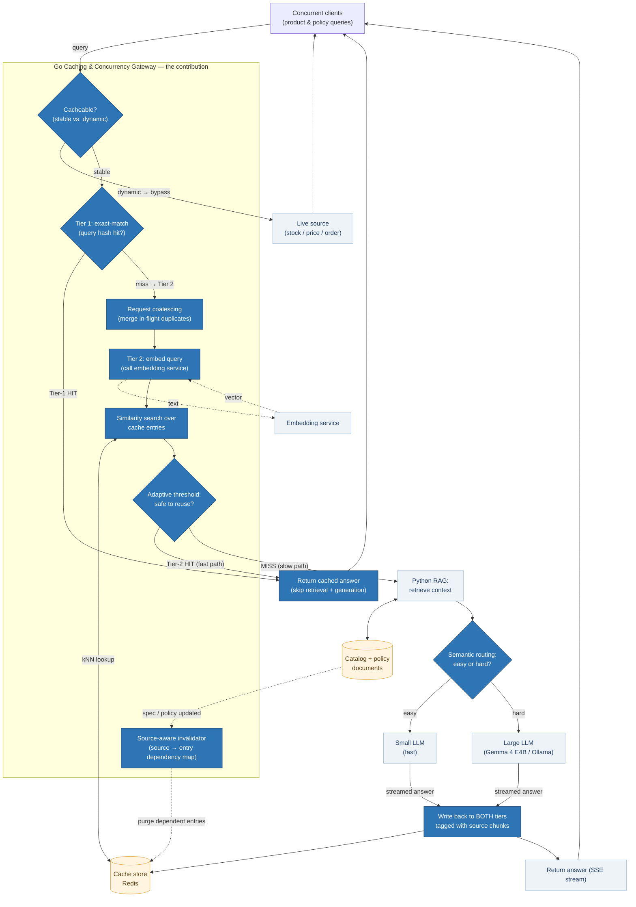

# Pre-Thesis Proposal

## A Scalable Question-Answering Platform for Product Specifications and Policies in E-Commerce
### High-Concurrency Query Handling through Adaptive Semantic Caching and Source-Aware Invalidation

---

**Domain:** Distributed Systems / Software Engineering / Applied LLMs
**Application:** E-commerce product & policy question-answering platform
**Core engineering contribution:** A scalability layer (tiered semantic cache + source-aware invalidation + concurrent request handling)
**Phase:** Pre-Thesis / Proposal

---

## Proposal at a Glance

*Each answer below is deliberately a single sentence — the whole proposal, compressed to eight lines (and reusable verbatim on defense slides).*

- **Problem.** A RAG question-answering assistant for e-commerce product and policy queries cannot serve many concurrent users, because throughput is capped by the LLM's expensive generation stage — which a naive pipeline re-runs even for questions it has already answered in different words.
- **Problem space.** The work sits in the semantic-caching layer of LLM serving systems, where distributed-systems techniques (caching, concurrency control, invalidation) meet the correctness demands of retrieval-grounded question answering.
- **Contributing factors.** Three factors create the problem: e-commerce traffic is highly redundant but heavily paraphrased (defeating exact-match caches), embedding similarity alone cannot distinguish a genuinely equivalent question from a dangerously similar one (causing false cache hits), and catalog/policy edits silently outdate cached answers (causing staleness).
- **How they connect to the problem.** Together these force a bad trade — regenerate every answer and saturate the LLM, or cache aggressively and serve wrong or stale answers — so scalability appears to be purchasable only at the price of correctness.
- **Proposed solution.** A two-tier caching gateway (Go) that decides answer reuse with RAG-aware signals — above all whether the incoming query retrieves the same source chunks that produced the cached answer — and, when sources change, invalidates exactly the dependent cache entries.
- **What will be learned.** Doing so tests whether retrieval provenance is a stronger reuse-safety signal than the embedding similarity all published semantic caches rely on, and measures how much concurrent load a correctness-preserving cache lets modest hardware absorb.
- **Methodology.** Build the platform on fixed commodity hardware, then measure it under concurrent, redundancy-swept load and controlled source edits, across eight cache configurations spanning internal baselines and the published state of the art (GPTCache, vCache).
- **Validation.** Two pre-registered headline results — throughput/latency curves with and without the cache, and a hit-rate/false-hit-rate frontier at a stated false-hit budget (δ ≤ 5%) — reported with confidence intervals against a measured judge-error noise floor, with a reportable negative result as the honest fallback.

---

## Table of Contents

0. [Proposal at a Glance](#proposal-at-a-glance)
1. [Introduction and Motivation](#1-introduction-and-motivation)
2. [Problem Statement](#2-problem-statement)
3. [Research Objectives and Contributions](#3-research-objectives-and-contributions)
   - [Contribution 1 — RAG-aware cache-reuse safety prediction (primary research contribution)](#contribution-1--rag-aware-cache-reuse-safety-prediction-primary-research-contribution)
   - [Contribution 2 — Source-aware cache invalidation](#contribution-2--source-aware-cache-invalidation)
   - [Contribution 3 — A scalability-and-correctness evaluation protocol](#contribution-3--a-scalability-and-correctness-evaluation-protocol)
4. [Proposed System Architecture](#4-proposed-system-architecture)
   - [4.1 Components](#41-components)
   - [4.2 Scalability Mechanisms](#42-scalability-mechanisms)
   - [4.3 Tiered Cache Design (exact + semantic)](#43-tiered-cache-design-exact--semantic)
   - [4.4 Scope Note — the cacheable slice](#44-scope-note--the-cacheable-slice)
   - [4.5 Architecture Diagram](#45-architecture-diagram)
5. [Technical Stack](#5-technical-stack)
   - [5.1 Experimental Environment and Constraints](#51-experimental-environment-and-constraints)
6. [Research Questions](#6-research-questions)
   - [RQ1 — Scalability under concurrency](#rq1--scalability-under-concurrency)
   - [RQ2 — RAG-aware reuse-safety vs. fixed thresholds and similarity-only learned caches](#rq2--rag-aware-reuse-safety-vs-fixed-thresholds-and-similarity-only-learned-caches)
   - [RQ3 — Source-aware invalidation](#rq3--source-aware-invalidation)
   - [RQ4 — Semantic routing (optional secondary lever)](#rq4--semantic-routing-optional-secondary-lever)
7. [Evaluation Design](#7-evaluation-design)
   - [7.1 Scalability (headline)](#71-scalability-headline-for-a-scalable-platform)
   - [7.2 Caching quality and correctness](#72-caching-quality-and-correctness)
   - [7.3 Datasets](#73-datasets)
8. [Positioning Against Existing Work and Research Ambition](#8-positioning-against-existing-work-and-research-ambition)
9. [Indicative Timeline](#9-indicative-timeline)
10. [Scope Guardrails](#10-scope-guardrails)
11. [Expected Deliverables](#11-expected-deliverables)
12. [Future Work](#12-future-work)

---

## 1. Introduction and Motivation

Retrieval-Augmented Generation (RAG) has become the standard way to ground Large Language Models (LLMs) in external knowledge: relevant documents are retrieved and injected into the prompt, reducing hallucination and producing fact-grounded answers. E-commerce is a natural application — shoppers ask constant questions about product specifications ("does this laptop support Thunderbolt?"), compatibility, warranty terms, return windows, and shipping policies, and an LLM-based assistant can answer them directly from the store's catalog and policy documents.

Moving such an assistant from a prototype to a platform that serves **many concurrent users**, however, exposes a scalability problem. Each query normally traverses the full pipeline — retrieval, then autoregressive generation — which is the most expensive stage. Under real e-commerce traffic three costs compound:

1. **Concurrency pressure.** Many users query at once, but the LLM can only generate a limited number of answers in parallel; the generation stage becomes the system bottleneck.
2. **Redundancy.** E-commerce query workloads are highly repetitive — the same product and policy questions are asked in many wordings, over and over — yet a naive pipeline regenerates each answer from scratch.
3. **Latency and cost.** Token-by-token generation dominates response time and compute; paying it repeatedly for near-duplicate questions is wasteful.

This pre-thesis builds a **scalable RAG question-answering platform** for e-commerce product and policy queries, and studies how to make it scale on modest hardware. The central engineering idea is that **the platform scales because a semantic caching layer absorbs redundant load that the LLM could not otherwise handle** — every cached answer is a request the expensive generation stage never has to process. Caching, concurrent request handling, and correctness-preserving cache invalidation are the scalability mechanisms; the RAG assistant is the platform they make scalable.

## 2. Problem Statement

A straightforward RAG assistant does not scale gracefully under concurrent e-commerce load, and the naive fixes introduce correctness risks:

- **The generation stage is the bottleneck.** Without a mechanism to avoid redundant generation, throughput is capped by how many answers the LLM can produce in parallel — low on modest hardware.
- **Exact-match caching is too weak.** Caching only string-identical queries misses the majority of real traffic, where the same question appears in many paraphrased forms.
- **Naive semantic caching is unsafe.** Reusing an answer whenever a query is "similar enough" risks serving a wrong answer to a merely similar question (a **false cache hit**) — unacceptable when the answer concerns warranty terms or return policy.
- **Catalog and policy data change.** When a product spec is corrected or a policy updated, cached answers derived from the old text silently go **stale** and remain served until they expire by time alone.

A platform that claims to be scalable must therefore not only raise throughput but do so **without degrading answer correctness** and **without serving stale answers after catalog/policy updates**. Existing semantic caches leave exactly these gaps: fixed-threshold tools (GPTCache and successors) trade hit rate against false hits along one blunt axis, while newer learned caches (vCache and successors) decide reuse from embedding similarity alone — and neither line offers principled invalidation when the source documents change.

## 3. Research Objectives and Contributions

The pre-thesis delivers a working scalable e-commerce RAG platform, whose scalability rests on a **caching-and-concurrency layer**. Its central *research* contribution is a **RAG-aware cache-reuse safety predictor** (Contribution 1); this is supported by a novel invalidation mechanism (Contribution 2) and a rigorous evaluation protocol (Contribution 3). The LLM, the embedding model, and the base RAG pipeline are supporting infrastructure, not contributions.

### Contribution 1 — RAG-aware cache-reuse safety prediction (primary research contribution)

First-generation semantic caches (GPTCache and successors) decide hit/miss with a **fixed cosine-similarity threshold**: reuse the cached answer if query similarity exceeds τ. A single global threshold cannot tell a genuinely equivalent question from one that is merely lexically close, so it trades hit rate against false hits along one blunt axis. Recent work has recognized this: **vCache** (arXiv:2502.03771) learns a per-cached-entry threshold online with a user-defined error-rate guarantee, and successors extend verified caching to tiered architectures (Apple, EuroMLSys 2026) and to offline-learned/online-adapted policies (arXiv:2508.07675). However, all of these operate at the **prompt level**: the only signal available to them is embedding similarity between query texts.

This work's position is that a RAG system has strictly richer reuse-safety signals than any prompt-level cache. The hit/miss decision is framed as a **learned safety-prediction problem over RAG-aware features**: given a candidate cached answer, predict the probability that *reusing it would be correct*, from query–cache-entry embedding similarity **plus signals only a RAG pipeline can provide** — above all **source-grounding overlap**: whether the incoming query's retrieval returns the same source chunks that produced the cached answer. Two questions can embed nearly identically ("what is the return window?" asked about two different product categories) yet ground in different chunks; source overlap separates them where similarity cannot. Answer-length/answer-type and question-type signals complete the feature vector. The cache reuses an answer only when predicted reuse-safety clears a target confidence, giving a principled, tunable operating point rather than a hand-set threshold.

**The signal is the contribution; the model is the combiner.** To attribute any win correctly, the signal is evaluated on a ladder: (i) the signal alone, as a **deterministic source-overlap rule** — *reuse iff the incoming query's retrieved chunks overlap the cached entry's source chunks above θ (optionally AND similarity ≥ τ)* — and (ii) the **learned predictor** that combines overlap with similarity and the auxiliary features. The ladder makes both outcomes informative: if the deterministic rule alone already beats similarity-only caching, the contribution is *retrieval provenance as a reuse-safety signal* and the learned model is calibration on top; if the predictor beats the rule, the learned combination demonstrably adds value. Without the rule as a baseline, no reviewer could tell whether the learning or the signal is doing the work. Accordingly, the contribution is stated as **identifying and validating retrieval provenance as a reuse-safety signal**, not as the (deliberately simple) predictor model itself.

**Feature cost at decision time.** Source-grounding features require running retrieval on the incoming query, so they are not free on the hit path. The design therefore uses a **feature cascade**: a cheap similarity-only check decides clear hits and clear misses, and only queries in the uncertain band pay for retrieval-based features. Retrieval is far cheaper than generation, so even the expensive branch preserves most of the cache's latency win — in effect, **the RAG retriever doubles as a cheap reuse-safety oracle**. Hit-path latency is reported inclusive of feature computation (§7.1), so this cost is measured, not hidden.

- **Novelty:** prior learned caches (vCache and successors) decide reuse from embedding similarity alone, because at the prompt level nothing else exists. The nearest neighbor is Apple's **Krites** (arXiv:2602.13165), which asynchronously LLM-judges near-miss entries to recover additional safe *static* hits — off the critical path and **without changing the serving decision rule**; this work instead changes the decision rule itself, using retrieval provenance at decision time, and adds invalidation under source churn. To our knowledge (as of July 2026), no published cache exploits **retrieval provenance** (source-chunk overlap) as a reuse-safety signal, nor integrates the reuse decision with source-aware invalidation (Contribution 2) — treating reuse safety and staleness as one question: *does the cached answer still follow from the current sources?*
- **Training labels:** generated automatically — for a set of (incoming query, candidate cached answer) pairs, a reference answer (from the full RAG pipeline, optionally LLM-judged) determines whether reuse *would* have been correct, yielding a labelled dataset with no manual annotation.
- **Claim to be tested:** at a stated false-hit budget (§8), the RAG-aware predictor sustains a higher hit rate than (a) the best fixed threshold, (b) GPTCache, (c) vCache's similarity-only learned thresholds, and (d) the deterministic source-overlap rule — with the advantage expected to concentrate on the dangerous cases where lexically close questions ground in different sources, and with the rule-vs-predictor comparison attributing how much of the win comes from the signal versus the learning.
- **Fallback:** if the RAG-aware predictor does not beat a well-tuned fixed threshold or the similarity-only learned baselines, that negative result — *retrieval provenance adds nothing over similarity* — is itself reportable, and the engineering platform (Contributions 2–3, all scalability mechanisms) still stands as a complete thesis. The research bet does not put the floor at risk.

### Contribution 2 — Source-aware cache invalidation

Each cache entry is tagged with the catalog/policy source chunks that produced its answer, forming a source→entry dependency map. When a product spec or policy document is edited, exactly the dependent entries are invalidated, rather than relying on blind time-to-live expiry. Beyond the mechanism, the invalidation is characterized by two measurable properties: **completeness** (no answer derived from changed source survives the update) and **precision** (unaffected entries are not needlessly purged). Reporting this completeness/precision trade-off, rather than just "it purges," is what lifts invalidation from an engineering feature toward a characterized algorithm.

### Contribution 3 — A scalability-and-correctness evaluation protocol

An evaluation methodology that measures the platform under **concurrent load** — throughput and latency percentiles as request rate rises — jointly with the correctness cost of caching (false-hit rate) and the staleness rate after catalog updates. Crucially, the caching contribution is benchmarked **directly against GPTCache and vCache** on a shared workload, not only against internal baselines, and results are reported with confidence intervals over multiple runs. The headline results are (a) a throughput/latency-under-concurrency curve with and without the cache, across workload-redundancy levels, and (b) a hit-rate/false-hit-rate frontier comparing the RAG-aware predictor against fixed thresholds, GPTCache, and vCache. The protocol itself is packaged as a **releasable benchmark artifact** — workload generator, controlled update set, and metrics harness — so it is reusable by others rather than merely described.

## 4. Proposed System Architecture

A decoupled design separates the high-concurrency caching gateway from the ML-heavy retrieval and generation components. The gateway implements a **two-tier cache**: an exact-match tier checked first, a semantic tier second, and the full RAG pipeline only on a miss.

- **Tier-1 hit (exact match):** Client → Go Gateway → hash lookup → cached answer. No embedding call, no similarity search — the cheapest path.
- **Tier-2 hit (semantic match):** Client → Go Gateway → (exact miss) → embed query → similarity search + adaptive threshold → cached answer. Catches paraphrases the exact tier misses.
- **Miss (slow path):** Client → Go Gateway → (both tiers miss) → Python RAG Service → Local LLM → answer returned and written back to **both** tiers, tagged with its source chunks.

### 4.1 Components

- **Go Caching & Concurrency Gateway (the contribution).** Handles concurrent incoming requests (goroutines, connection pooling); runs the two-tier lookup (O(1) exact tier, then adaptive semantic tier); coalesces simultaneous near-identical queries so they trigger only one backend call; and maintains the source→entry dependency map for invalidation. Implemented in Go for its concurrency model and low memory footprint — and because it matches the author's backend background.
- **Python RAG Service (infrastructure).** Parses the product catalog and policy documents, chunks and embeds them, builds the vector index, and retrieves context. Invoked only on a cache miss.
- **Local LLM (infrastructure).** An open-weights model served locally (Gemma 4 E4B via Ollama, 4-bit quantized, `num_ctx` fixed at 8K — see §5.1). Local hosting removes API cost and keeps latency measurements reproducible. The model is a consumed black box, not a contribution.
- **Embedding service.** The gateway obtains query embeddings via an embedding endpoint; the embedding model need not run inside Go.

### 4.2 Scalability Mechanisms

The word "scalable" in the title is earned by concrete, measurable mechanisms, not by scale in the abstract. They attack the pipeline at three points — avoiding the LLM call, raising throughput under concurrency, and lowering perceived latency. The tiered cache is the flagship; the others are secondary levers that round out the platform.

**Primary — avoiding the expensive LLM call:**

- **Tiered semantic caching (flagship).** Converts expensive miss-path requests into cheap hit-path requests. Every hit is a generation the LLM never performs, so the cache is what lets throughput exceed the LLM's parallel-generation ceiling.
- **Source-aware invalidation.** Keeps the growing cache *correct* as catalog/policy data changes — scalability includes staying right under churn, not only staying fast.

**Secondary — raising throughput under concurrency:**

- **Concurrent request handling.** The Go gateway serves many simultaneous requests without blocking; cache hits are served with high concurrency because they never touch the LLM.
- **Request coalescing.** When many users ask the same question at nearly the same moment (a "thundering herd" on a popular product), the gateway issues one backend call and fans the single answer out to all waiters.
- **Semantic routing / model cascading.** Most product and policy questions are simple; only a minority need the largest model. A lightweight classifier routes easy queries to a small, fast model and reserves the larger model for hard ones, raising throughput and lowering average cost. This is a second, independent scalability lever that lives naturally in the gateway alongside the cache.
- **Backpressure / admission control.** When the LLM saturates under load, the gateway queues or sheds excess requests gracefully (with a clear "busy, retry" signal) rather than letting latency explode or the system collapse. This is the mechanism that makes the platform *degrade gracefully* at saturation — the behaviour the scalability evaluation (§7.1) measures.

**Latency (perceived responsiveness):**

- **Streaming responses (SSE).** On a miss, answer tokens are streamed to the client as they are generated, so time-to-first-token is low even when full generation takes seconds. This improves *perceived* speed independently of throughput, and costs little to implement.

**Discussed but out of core scope — continuous batching.** The single most powerful LLM-serving throughput technique is continuous (dynamic) batching, where the server groups concurrent requests through the model together (as in vLLM). On the single-machine Ollama setup used here, control over batching is limited; the platform demonstrates what batching Ollama exposes and analyzes the throughput implications, while full dynamic batching on a dedicated serving engine is identified as future work (§12). To pre-empt the natural objection that the cache only looks heroic because Ollama's miss path is slow, Ollama's actual concurrency behaviour is **characterized explicitly** (a documented `OLLAMA_NUM_PARALLEL` sweep as a preliminary experiment), and the headline claim is framed as **load conversion** — *the cache converts miss-path load into hit-path load* — which holds under any serving engine, rather than as a raw throughput multiplier, which would depend on how slow the chosen engine happens to be.

### 4.3 Tiered Cache Design (exact + semantic)

- **Tier 1 — exact-match.** A hash of the normalized query maps directly to a stored answer. O(1), no embedding cost. Handles identical repeats (very common in product/policy traffic) at lowest latency and avoids spending an embedding call on queries the semantic tier would match anyway.
- **Tier 2 — semantic.** On a Tier-1 miss, the query is embedded and matched using the adaptive threshold (Contribution 1). Handles paraphrases the exact tier cannot.
- **Write-back to both.** On a full miss, the generated answer populates both tiers, tagged with its source chunks, so source-aware invalidation (Contribution 2) purges dependent entries from both tiers uniformly.
- **Bounded capacity.** The cache runs at a **fixed, stated capacity with LRU eviction** in all experiments. Published learned caches (vCache) assume an unbounded cache and ignore replacement; that assumption is explicitly not inherited here. Designing better replacement policies is out of research scope — the bound exists so results are reproducible and honest, not to study eviction.

### 4.4 Scope Note — the cacheable slice

E-commerce answers split into **stable** content (product specifications, compatibility, warranty and return policies, shipping rules) and **dynamic** content (live stock, per-user pricing, order status). Semantic caching applies to the **stable** slice, which is where this platform focuses and where redundancy is highest. Dynamic queries are routed straight to a live source and bypass the cache; correctly *classifying* a query as cacheable vs. bypass is part of the gateway's logic. This scoping is a deliberate design decision, not a limitation — it targets caching where it is both safe and valuable.

Two further scope boundaries are explicit. **Single-turn queries only:** the cache is keyed on self-contained query text, so multi-turn, context-dependent questions ("does it come in red?") are out of scope; a production deployment would resolve them to standalone form upstream. **No personalization:** answers that vary by locale, membership tier, or user account (regional return windows, member pricing) are treated as dynamic and bypass the cache; extending the cache key with a locale dimension is future work (§12).

### 4.5 Architecture Diagram

**Reading the diagram.** A query is first classified as **cacheable** (stable product/policy info) or **dynamic** (stock/price/order — bypassed to a live source). Cacheable queries hit **Tier 1 (exact-match)** first — an O(1) hash check — then fall through to **request coalescing** and **Tier 2 (semantic)**: embed, search, adaptive hit/miss. On a miss, **semantic routing** sends easy queries to a small fast model and hard ones to the large model, and the answer is **streamed** back (SSE) for low time-to-first-token. Blue nodes are the contribution; grey are consumed infrastructure; orange are stores. Both fast paths exit without touching the LLM. Dotted lines are out-of-band flows: embedding lookups, and **source-aware invalidation** (bottom) — a catalog/policy edit triggers the invalidator to purge exactly the dependent entries rather than waiting for TTL.

## 5. Technical Stack

| Layer | Technology | Rationale |
| :--- | :--- | :--- |
| Caching & concurrency gateway | Go (Gin or Fiber) | Concurrency primitives, native binary, low idle memory; matches author's strengths |
| Cache store + vector search | Redis (Redis Stack / RedisVL) | Vector similarity plus key/value TTL and eviction in one store the author already knows |
| RAG orchestrator | Python 3.11+ (LlamaIndex) | Mature ingestion, chunking, and vector-index abstractions |
| Local LLM runtime | Ollama | Simple local model management and API exposure |
| Target model (large) | Gemma 4 E4B (open-weights) | Edge-optimized; 4.5B effective / 8B total params incl. embeddings (per Gemma 4 model card); small memory footprint |
| Routing model (small) | A smaller open-weights model via Ollama | Serves easy queries under semantic routing (RQ4); reserves the large model for hard ones |
| Response streaming | Server-Sent Events (SSE) | Low time-to-first-token on the miss path — perceived responsiveness |
| Reuse-safety predictor | scikit-learn / lightweight model (e.g. gradient-boosted trees or a small MLP) | Learns cache-reuse safety from labelled (query, cached-answer) pairs — Contribution 1 |
| Baselines for comparison | GPTCache, vCache | External baselines: fixed-threshold state of practice and learned similarity-only state of the art, benchmarked directly (RQ2) |
| Service communication | gRPC (Protocol Buffers) | Binary serialization between Go and Python |
| Load testing | k6 or Locust | Concurrent traffic generation for the scalability evaluation |

**Note on vector search:** a semantic cache is small (recent/frequent Q&A, not the whole catalog), so brute-force cosine over in-memory entries is viable for a few thousand entries; Redis vector search is the next step if scale demands. A heavyweight dedicated vector DB is not required for the cache itself.

### 5.1 Experimental Environment and Constraints

All experiments run on a single Apple Silicon machine (MacBook M1, 16 GB unified memory), with the Go gateway, Redis, the Python RAG service, and the local LLM co-hosted. This fixed, documented envelope is what makes the throughput and latency measurements reproducible.

- **Local model, fixed context.** Gemma 4 E4B (4-bit, via Ollama), `num_ctx` **fixed at 8,192 tokens** for all runs. A product/policy query (system prompt + a few retrieved chunks + the question) is ~2K–6K tokens, so 8K covers the workload with margin and leaves unified memory for Redis, the gateway, and the RAG service to run concurrently. `OLLAMA_NUM_PARALLEL` is likewise pinned and reported for all runs, since it sets the parallel-generation ceiling the evaluation measures against.
- **The LLM is the throughput ceiling — and that is the point.** On this hardware the LLM can only generate a few answers in parallel, so the **miss path** has low, model-bounded throughput. The **hit path** (no LLM call) has high throughput. The scalability thesis is precisely that the cache converts miss-path load into hit-path load; the evaluation measures how much load the cache absorbs before the LLM saturates. A preliminary experiment characterizes Ollama's concurrency directly (miss-path throughput across `OLLAMA_NUM_PARALLEL` settings), so the miss-path baseline is a measured quantity rather than an assumption. Claims are scoped to this hardware envelope, not to hypothetical clusters, and are stated as load conversion rather than raw multipliers (§4.2).
- **Memory-pressure discipline.** Weights and KV cache share the unified memory pool. Runs are valid only while macOS memory pressure stays green (no swap); runs that enter yellow/red are discarded and repeated at lower load, since swapping contaminates latency.
- **Clean vs. noisy latency, attributed separately.** Cache hits never invoke the LLM, so hit-path latency is measured cleanly; miss-path latency (retrieval + generation) is reported separately with p50/p95/p99 so the caching benefit is not confounded by generation cost.
- **Load generation off-box.** k6/Locust runs on a **separate machine on the local network**, not co-hosted with the system under test — a co-hosted generator steals CPU from the gateway and LLM at exactly the high-load region being measured. If a second machine is unavailable for a run, generator interference is measured and reported alongside the results.

## 6. Research Questions

### RQ1 — Scalability under concurrency

How does the platform's throughput (queries/second) and latency (p50/p95/p99) behave as concurrent request rate rises, **with vs. without** the caching layer — and how does the benefit scale with workload redundancy? *Experiment:* drive increasing concurrent load with k6/Locust against both configurations **at several workload-redundancy levels (Zipf-skew sweep, §7.1)** and plot throughput and latency curves up to saturation; quantify the extra load the cache absorbs and where the LLM becomes the bottleneck.

### RQ2 — RAG-aware reuse-safety vs. fixed thresholds and similarity-only learned caches

Does the RAG-aware cache-reuse safety predictor (Contribution 1) achieve a better hit-rate / false-hit-rate frontier than (a) the best fixed cosine threshold, (b) fixed-threshold prior art (GPTCache), (c) learned similarity-only prior art (vCache), and (d) the **deterministic source-overlap rule** — the last comparison attributing whether the signal or the learning does the work? *Experiment:* sweep fixed thresholds (e.g. 0.80–0.98) to trace the fixed-threshold frontier; sweep the overlap threshold θ to trace the deterministic rule's frontier; run GPTCache and vCache on the same workload as external baselines, **with the same embedding model pinned across all systems** so the comparison isolates the reuse-decision policy rather than embedding quality; then plot the predictor's frontier against all four, with confidence intervals over multiple runs. A better frontier (more reuse at equal-or-lower false-hit rate) at the stated false-hit budget (§8) is the target result.

### RQ3 — Source-aware invalidation

When product specs or policies change, can dependency-tagged invalidation purge exactly the affected entries and reduce the staleness rate relative to TTL-only expiry, without over-invalidating unaffected entries? *Experiment:* apply controlled catalog/policy updates and measure stale-answer rate and invalidation precision before and after.

### RQ4 — Semantic routing (optional secondary lever)

Can a lightweight easy/hard classifier route a majority of product/policy queries to a small fast model — raising throughput and lowering average cost — without materially lowering answer correctness? *Experiment:* measure the classifier's routing accuracy, the throughput/cost gain from serving easy queries on the small model, and the correctness delta versus always using the large model.

## 7. Evaluation Design

### 7.1 Scalability (headline for a "scalable" platform)

Under concurrent load generated by k6/Locust, at rising request rates, for **cache-on vs. cache-off**:

| Metric | What it captures |
| :--- | :--- |
| Throughput (queries/sec) | Sustained request rate served before saturation |
| Latency p50 / p95 / p99 | Response-time distribution as concurrency rises |
| Saturation point | Load at which the LLM (miss path) becomes the bottleneck |
| Load absorbed by cache | Share of concurrent load served from cache without touching the LLM |

**Workload redundancy as an independent variable.** A cache's benefit is a function of workload redundancy, and a self-constructed workload makes redundancy a knob the experimenter controls — a single headline number would be self-fulfilling. Query popularity therefore follows a **Zipf distribution** (as observed in real e-commerce query logs), the skew parameter is **swept across runs**, and throughput and hit rate are reported *as a function of redundancy* rather than at one hand-picked level.

**Headline result A:** throughput-and-latency-vs-concurrency curves, across the redundancy sweep, showing the cache-on platform sustaining substantially higher load at bounded latency, and degrading gracefully at saturation.

### 7.2 Caching quality and correctness

Eight configurations on identical query workloads (configs 2 and 7 are also the two tiers of the final system, so this doubles as an ablation); all caching configurations are pinned to the **same embedding model**, so the comparison isolates the reuse-decision policy:

1. **No cache** — the latency/cost ceiling.
2. **Exact-match only** (Tier 1) — trivial baseline and the cheap tier in isolation.
3. **Fixed-threshold semantic** — internal state-of-practice baseline (best τ found by sweep).
4. **Source-overlap rule (deterministic, signal-only)** — reuse iff source-chunk overlap ≥ θ (best θ found by sweep); isolates the provenance signal from the learning.
5. **GPTCache** — external fixed-threshold system; the legacy prior art.
6. **vCache** — external learned similarity-only system; the current state of the art.
7. **RAG-aware predictor semantic + source-aware** (Tier 2) — the core research contribution.
8. **Tiered: exact + RAG-aware predictor semantic** — the full system.

| Metric | What it captures |
| :--- | :--- |
| Cache hit ratio | Hits ÷ total incoming queries |
| False-hit rate (headline) | Fraction of hits that returned an incorrect answer — the correctness cost of caching |
| Reuse-safety AUC / precision-recall | Quality of the learned predictor itself (Contribution 1) |
| Staleness rate | Fraction of answers served stale after a catalog/policy update (RQ3) |
| Invalidation completeness / precision | No stale entry survives a change; unaffected entries not over-purged (Contribution 2) |
| Token / compute cost saved | Generation work avoided on cache hits |
| Embedding calls saved | Share of queries answered by Tier 1 without embedding |
| Decisions changed by source features | How often the provenance features flip the similarity-only outcome — if rarely, the signal's contribution is thin regardless of AUC |
| False hits by cause | Attribution of every false hit: reuse-decision error vs. bypass misroute vs. staleness — kept separate so the predictor is not blamed for classifier or invalidation failures |
| Bypass-classifier accuracy | Correctness of the cacheable-vs-dynamic routing (§4.4), measured separately as its own false-hit source |

**Headline result B:** the hit-rate / false-hit-rate frontier of the RAG-aware predictor plotted against the fixed-threshold sweep, the deterministic source-overlap rule, GPTCache, *and* vCache — with confidence intervals over multiple runs — demonstrating (the claim to be tested) more reuse at equal-or-lower error than all four at the stated false-hit budget (§8), with the rule-vs-predictor gap attributing signal versus learning.

### 7.3 Datasets

- **Product catalog + policy corpus:** product specifications drawn from a public Amazon product-data corpus (McAuley-lab Amazon datasets), plus a **self-constructed policy corpus** (returns, warranty, shipping) modelled on real store policy pages. Building the policy corpus in-house is a feature, not a compromise: the invalidation experiment (RQ3) requires controlled edits, which only a corpus under the author's control permits.
- **Query workload:** real shopper questions from the Amazon product-Q&A data (AmazonQA / McAuley-lab), with reference answers for correctness scoring. Real questions carry **natural paraphrase structure** — many users asking the same thing in different words — which exercises the semantic tier more honestly than machine paraphrases alone; generated paraphrases supplement where coverage is thin (notably policy questions).
- **Paraphrase stress set:** natural paraphrase clusters mined from the Q&A data, supplemented with machine-generated paraphrases of seed questions, designed so exact-match caching fails and the semantic tier is genuinely exercised — also the workload that drives redundancy in the load tests (Zipf-distributed popularity, skew swept — §7.1).
- **Update set:** a set of controlled spec/policy edits for the invalidation experiment (RQ3), so "stale after change" can actually be measured.
- **Reuse-safety dataset (for Contribution 1):** a labelled set of (incoming query, candidate cached answer) pairs, each labelled reuse-safe or reuse-unsafe by comparing against the full-pipeline reference answer. Generated automatically from the query workload — no bulk manual annotation — and split train/validation/test to train and evaluate the reuse-safety predictor honestly (no test leakage). Label quality is itself validated: the LLM judge is a **different model from the answer generator** (avoiding self-agreement bias), and a random sample (~200 pairs) is **human-verified** with judge–human agreement reported. The measured judge error is treated as the **noise floor of the false-hit metric** — the operating budget δ (§8) must clearly exceed it — and the number of judged hits behind each frontier point is sized by a **binomial power analysis** so that reported differences between configurations are resolvable, not artifacts of sample size.

## 8. Positioning Against Existing Work and Research Ambition

A focused review of recent LLM semantic-caching literature will be completed before implementation — the field is moving fast, so the sweep is refreshed at thesis-phase start and explicitly includes the **RAGCache / cache-augmented-generation** line (caching *inside* the RAG pipeline: retrieved-context and KV reuse), which is complementary to response-level caching but an expected examiner question. The response-caching field has two generations: **fixed-threshold caches** (GPTCache and successors), and **learned similarity-only caches** — vCache (learned per-entry thresholds with error-rate guarantees, arXiv:2502.03771), Apple's **Krites** (asynchronous verified semantic caching for tiered architectures, EuroMLSys 2026, arXiv:2602.13165), and offline-learned/online-adapted caching policies (arXiv:2508.07675). Krites is the nearest neighbor and deserves emphasis: it expands safe *static*-cache coverage by LLM-judging near-misses asynchronously, off the critical path, **without changing the serving decision rule** — whereas this work changes the decision rule itself, at decision time, using signals Krites does not have (retrieval provenance). **Intended differentiation from both generations:** all published caches operate at the prompt level and decide reuse from embedding similarity alone; to our knowledge (as of July 2026), none exploits retrieval provenance, and none addresses cache correctness when the underlying knowledge base changes. This work's novelty is **RAG-aware reuse-safety prediction** using source-grounding features (Contribution 1), **characterized source-aware invalidation** with completeness/precision properties (Contribution 2), and evaluation under **concurrent load with direct GPTCache and vCache comparisons** and statistical rigor (Contribution 3).

The differentiation is demonstrated, not just asserted: GPTCache and vCache are run as external baselines on the same workload (RQ2), so the claim "RAG-aware reuse prediction beats similarity-only caching" is measured against the actual state of the art rather than a strawman.

**Target operating point.** Frontiers are compared at a stated **false-hit budget**, provisionally **δ ≤ 5%**, chosen for *measurability*, not ambition. Two constraints bound δ from below. First, false hits are scored by an LLM judge, and the judge's own error rate — measured against the human-verified sample (§7.3) — is the metric's **noise floor**: a budget below the judge's error cannot be certified at all, and a ~200-pair human check pins judge accuracy only to roughly ±3%. Second, resolving a rate near 1% with useful confidence requires on the order of 10,000 judged hits per frontier point (binomial), which the workload cannot affordably supply for every configuration. δ is therefore set provisionally at 5%, finalized once the judge's measured error is known (δ must clearly exceed it), and each frontier point is sized by an explicit **power analysis**. The headline claim takes the concrete, falsifiable form: *at δ ≤ 5%, the RAG-aware predictor sustains a higher hit rate than the best fixed threshold, the deterministic source-overlap rule, GPTCache, and vCache.* This mirrors how vCache itself states its guarantees, making the comparison direct.

**Research ambition.** If the RAG-aware reuse-safety predictor demonstrably beats similarity-only caching (fixed and learned), the result is a self-contained novel contribution suitable for a short paper at a student or regional venue; submission will be pursued as a stretch goal. This is explicitly optional and does not gate the thesis — but framing and executing the work to a publishable standard (clean baselines, ablations, significance testing, honest limitations) is the standard the evaluation is held to.

## 9. Indicative Timeline

### Pre-thesis phase — proposal + working prototype

| Phase | Work |
| :--- | :--- |
| Weeks 1–5 (Jul–Aug 2026) | Literature review and positioning (GPTCache, vCache, and verified-caching successors); finalize the corpus and query workload (Amazon Q&A + constructed policy corpus); build the base RAG pipeline end-to-end |
| Weeks 6–8 (Aug–Sep 2026) | Exact-match (Tier 1) and fixed-threshold semantic (Tier 2) caches working end-to-end behind the Go gateway; basic concurrent handling; demo-ready prototype with preliminary measurements |
| Week 9 (Sep 2026) | Pre-thesis defense: report + prototype demonstration, with a preliminary load test as a teaser for the thesis-phase evaluation |

### Thesis phase — research core + full evaluation

| Phase | Work |
| :--- | :--- |
| Early | Source-aware invalidation; coalescing, backpressure, streaming (SSE), optional routing; **generate the reuse-safety dataset (with judge validation) and train the RAG-aware predictor (Contribution 1)**; build the load-testing harness (k6/Locust, off-box) |
| Middle | Scalability sweeps (cache-on vs. cache-off, across the redundancy sweep); fixed-threshold sweep; **direct GPTCache and vCache benchmarks**; invalidation completeness/precision experiment |
| Late | Produce the throughput/latency curves and the predictor-vs-threshold-vs-GPTCache-vs-vCache frontier with confidence intervals; write up |
| Stretch (optional) | If the predictor beats the similarity-only baselines, prepare a short paper for a student/regional venue |
| Buffer | Reserved at the end — load testing and experiments consistently overrun the build |

The thesis phase runs mid-September to mid-December 2026 (~13 weeks, part-time), with buffer extending into January 2027 if a fourth month is available. The full week-by-week plan, including the learning path and risk register, is maintained in `docs/time_line.md`.

## 10. Scope Guardrails

- **Keep the platform lean.** The assistant and UI are hosts for the scalability layer, not products; effort spent gold-plating them is taken from the contribution that earns the grade.
- **Freeze one LLM and one embedding model early.** Swapping models mid-study invalidates cross-configuration and cross-load comparisons.
- **Cache only the stable slice.** Do not attempt to cache dynamic (stock/price/order) queries; classify-and-bypass instead. Fighting the domain's dynamic content wastes effort and risks false hits.
- **The platform is the thesis; the predictor is the swing.** For an engineering-oriented evaluation, the working concurrent platform and its rigorous measurement earn the grade; the RAG-aware predictor (Contribution 1) is the research swing on top, and the GPTCache/vCache benchmarks are what certify it. If the predictor does not beat a tuned fixed threshold or the similarity-only baselines, report that honestly — the platform still stands as a complete, strong thesis. Never sacrifice the platform's core to chase the predictor.
- **Drop order under time pressure.** Non-negotiable: tiered caching, source-aware invalidation, the load-testing evaluation, and the GPTCache/vCache comparison. Droppable in order if time runs short: the paper (stretch only), streaming, semantic routing (RQ4 optional), request coalescing. The RAG-aware predictor is droppable *only* as a last resort — falling back to the deterministic source-overlap rule or a fixed threshold — since it is the main path to a distinguished result.
- **Feasibility honesty.** Contributions 1–3 done rigorously are *expected* to consume the entire part-time budget. The plan therefore assumes the secondary levers — semantic routing (RQ4), request coalescing, SSE streaming, and anything beyond basic queue-limit backpressure — will likely be cut, and treats any that ship as upside rather than commitments. They remain in the design because they are cheap to describe and natural extensions of the gateway, not because all of them are promised.

## 11. Expected Deliverables

1. A containerized, open-source scalable RAG platform (Go gateway + Python RAG + local LLM over gRPC) for e-commerce product and policy question-answering.
2. **A RAG-aware cache-reuse safety predictor** and the automatically-labelled, judge-validated dataset used to train it — the primary research artifact.
3. Empirical scalability benchmarks: throughput and latency under concurrency, cache-on vs. cache-off, with saturation analysis.
4. A caching-quality evaluation benchmarking the RAG-aware predictor against fixed thresholds, **GPTCache, and vCache**, reported with confidence intervals — including the hit-rate/false-hit-rate frontier at the stated false-hit budget and the invalidation completeness/precision result.
5. A reusable evaluation protocol for correctness- and staleness-aware semantic caching, **released as a runnable benchmark artifact** (workload generator, controlled update set, metrics harness) rather than merely described.

## 12. Future Work

- **Inference-level prompt / KV caching.** This platform caches at the *response* level (avoiding the LLM call). A complementary, orthogonal optimization is provider- or runtime-side prompt/KV caching, which cheapens the *miss path* by reusing attention over a repeated prompt prefix. The two stack: response caching reduces how often the LLM is called; prompt caching reduces the cost of each unavoidable call.
- **Continuous / dynamic batching on a dedicated serving engine.** The strongest LLM-throughput technique groups concurrent requests through the model together (as in vLLM). Beyond what the single-machine Ollama setup exposes, running the miss path on a batching-capable serving engine is the natural way to raise miss-path throughput further.
- **Load-adaptive routing.** Extending semantic routing (RQ4) so the easy/hard threshold shifts with current load — routing more aggressively to the small model as the system approaches saturation.
- **Distributed / shared cache.** Extending beyond a single instance to a shared multi-user cache, where the source-aware invalidation map becomes a genuine distributed-consistency problem.